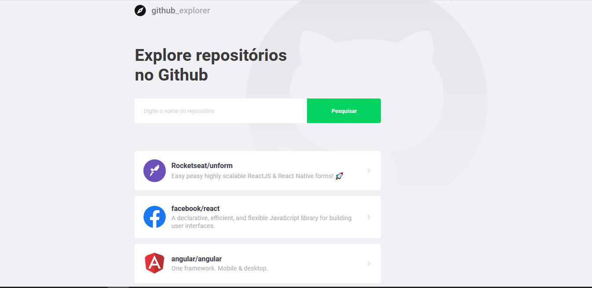
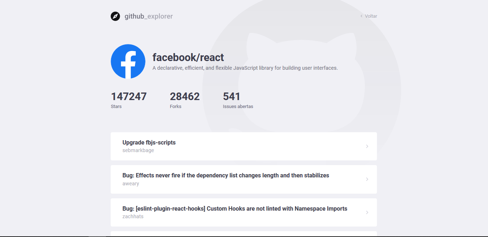

O Github-Explorer é um projeto feito em Reactjs desenvolvido durante o bootcamp GoStack da @rocketseat, consiste em uma aplicação que integra a API pública do Github ao frontend, salvando os repositórios, pesquisando e listando todas as issues que foram feitas nele. Para rodar esse projeto você pode clonar o repositório, na pasta dar o comando yarn para instalar as dependências e depois yarn start

